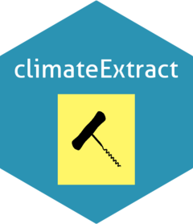

### climateExtract 

<!-- badges: start -->
[](https://app.travis-ci.com/RetoSchmucki/climateExtract)
<!-- badges: end -->


### R functions to extract and manipulate ECAD climate data
* ECAD at [Copernicus Climate](https://surfobs.climate.copernicus.eu/dataaccess/access_eobs.php#datafiles)
* Package URL: [https://retoschmucki.github.io/climateExtract/](https://retoschmucki.github.io/climateExtract)

> Before extracting any data, please read carefully the description of the datasets and the different grid size available (eg. 0.25 deg. regular grid, "TG" average temperature).
> Note shorter time-series are also available [Copernicus Climate](https://surfobs.climate.copernicus.eu/dataaccess/access_eobs.php#datafiles)

#### News
* 07/11/2023 ("Fast-Rose")
  - Updated to E-OBS v28.0 (Oct 2023)
    1. extending data from January 1950 to December 2023
    2. fully update to the `terra` package
    3. included the `geodata` package
    4. removed former dependency to the `zoo` package

* 30/04/2023 ("Witty-Rose")
  - Updated to E-OBS v27.0 (April 2023)
    1. extending data from January 1950 to December 2022
   
* 16/06/2022 ("Curious-Rose")
  - Updated to E-OBS v25.0 (June 2022)
    1. extending data from January 1950 to December 2021
    2. Fixed a bug in GDD producing NA when minimum and maximum temperatures were the same. 

* 03/02/2022
  - Updated to E-OBS v24.0 (November 2021)
    1. extending data from January 1950 to June 2021 

* 29/11/2021 ("Climbing-Rose")
  - added Growing Degree Day functions
    1. compute gdd with the average temperature method
    2. compute gdd using Baskerville-Emin method
    3. compute the cumulative sum over RasterBrick layers

* 14/07/2021
  - added functionality for three new variables
    1. daily averaged sea level pressure PP
    2. daily averaged relative humidity HU 
    3. daily mean global radiation QQ

* 07/04/2021 ("Wild-Rose")
  - Updated to E-OBS v23.1 (March 2021) 
  - Optimized several functions
  - Added option to write data to a raster brick
  - Better used of memory
  - Extract data within a bounding box of polygons or points
  - Option to manually select the E-OBS version

#### Installation

GitHub installation (CRAN not available)

```
install.packages("devtools")
devtools::install_github("RetoSchmucki/climateExtract")
```

Dependancies: `ncdf4`, `data.table`, `sf`, `sp`, `raster`, `geodata`, `terra`, `zoo`, `methods`

#### Usage

Check default ECAD version (can be changed with `ecad_v = xx.x`)

```R
library(climateExtract)
ecad_version
```

Define specific regions and/or points. If not provided, data will be extracted from the entire ECAD extent.

```R
# use set.seed() for reproducibility
set.seed(42876) 
fr_border = sf::st_as_sf(geodata::gadm("GADM", country = "FRA", level = 0))
sf_point = sf::st_sf(sf::st_sample(x = fr_border, size = 25, type = "random"))
```

Extract data
- Retrieve climate data from E-OBS server or a local file if available.
- Crop to the extent of the spatial object provided.
- Specify years and data of interest; see details help(extract_nc_value). 
- Write output to local disk with `write_raster=TRUE` 
- If `return_data = TRUE`, an R object (a list) with the climate values is created.  

```R
climate_data = extract_nc_value(first_year = 2012, 
                                last_year = 2015,
                                local_file = FALSE,
                                file_path = NULL,
                                sml_chunk = "2011-2023",
                                spatial_extent = fr_border,
                                clim_variable = "mean temp",
                                statistic = "mean",
                                grid_size = 0.25,
                                ecad_v = NULL,
                                write_raster = TRUE,
                                out = "raster_mean_temp.tiff",
                                return_data = TRUE)
```

Connect to the raster brick created on the local disk. If too big to be stored in Memory, the raster package will set a pointer to the file.

```R
rbk = terra::rast("raster_mean_temp.tiff")
format(object.size(climate_data), "MB")
format(object.size(rbk), "MB")
```

Aggregate the data over time, "annual", "monthly" or by using a rolling "window". The function `mean` could be replaced by `sum, `sd`, or other functions that can be computed along a vector. If "daily" is selected as time_step, no aggregation is conducted as ECAD data are provided on a daily scale. 

```R
# monthly mean
monthly_avg_temp_R = temporal_aggregate(x = rbk,
                                        agg_function = "mean",
                                        variable_name = "average temp",
                                        time_step = "monthly")
# annual mean
annual_avg_temp_R = temporal_aggregate(x = rbk,
                                       agg_function = "mean",
                                       variable_name = "average temp",
                                       time_step = "annual")
# 7-day rolling mean
window_7d_avg_temp_R = temporal_aggregate(x = rbk,
                                          agg_function = "sum",
                                          variable_name = "average temp",
                                          time_step = "window",                                          ,
                                          win_length = 7)
```

>Note: Argument in `x` could also be the climate_data object that resulted from the `extract_nc_value()` function.

Aggregation for points if a spatial point object is provided in `y` argument (e.g., `y =` sf_point`).


```R
# annual mean per point
annual_avg_temp_pnts = temporal_aggregate(x = rbk,
                                          y = sf_point,
                                          agg_function = "mean",
                                          variable_name = "average temp",
                                          time_step = "annual")
```
>Note: Here, `site_1` is located along the coast and falls outside the raster grid cell with a value, the value returned correspond to the nearest cell with a value. Distance_from_pnt indicates distance to cell centroid, when within a cell with value, this is NA.

Map of the aggregated layer. For a map of the average temperature for Sept 2012, use layer `"2012.09"`.

```R
terra::plot(monthly_avg_temp_R[["2012.09"]])
```

Add points to the map, here with a circle around their first points.

```R
terra::plot(monthly_avg_temp_R[["2012.09"]])
plot(sf_point, col = 'magenta', pch = 17, add = TRUE)
plot(sf_point[1,], col = 'blue', border= 1.5, cex= 2, pch = 1, add = TRUE)
```

#### GDD

Calculate growing degree day values using your preferred base temperature and method. There are a number of new functions for calculating GDD values and cumulative sum (accumulated) GDD over user-defined periods. First, you need to get the daily average temperature or the minimum and maximum if you want to use the Baskerville-Emin method (method = 'be'), which fits a sine curve to the minimum and maximum to account for daily temperature fluctuations.

```R
# get minimum temperature 

climate_data_min = extract_nc_value(first_year = 2012, 
                                    last_year = 2015,
                                    local_file = FALSE,
                                    file_path = NULL,
                                    sml_chunk = "2011-2023",
                                    spatial_extent = fr_border,
                                    clim_variable = "min temp",
                                    statistic = "mean",
                                    grid_size = 0.25,
                                    ecad_v = NULL,
                                    write_raster = TRUE,
                                    out = "raster_min_temp.tiff",
                                    return_data = TRUE)

rbk_min = terra::rast("raster_min_temp.tiff")

climate_data_max = extract_nc_value(first_year = 2012,
                                    last_year = 2015,
                                    local_file = FALSE,
                                    file_path = NULL,
                                    sml_chunk = "2011-2023",
                                    spatial_extent = fr_border,
                                    clim_variable = "max temp",
                                    statistic = "mean",
                                    grid_size = 0.25,
                                    ecad_v = NULL,
                                    write_raster = TRUE,
                                    out = "raster_max_temp.tiff",
                                    return_data = TRUE)

rbk_max = terra::rast("raster_max_temp.tiff")
```
Using the function `gdd_extract()` we can calculate the GDD, specifying the base temperature and the preferred method,
Baskerville-Emin method (method = 'be') or simply the average daily temperature (method = 'avg'). For the average method you can specify either the mean_temp or the min_temp and max_temp. For the 'be' method, both min_temp and max_temp are needed.

```R
be_gdd_france <- gdd_extract(base_temp = 7,
                            min_temp = rbk_min,
                            max_temp = rbk_max,
                            gdd_method = 'be')

# visualise the GDD-base7, for June 16th 2012
terra::plot(be_gdd_france[["2012-06-16"]])
```

The output is a RasterBrick (multilayer raster) that you can use with the function `temporal_aggregate()` to calculate the sum, mean or rolling window mean. In general, however, we need the cumulative sum, i.e. the accumulation of GDD over a certain period of time. For this task, you can use the function `cumsum_rb()` (cumulative sum on RasterBrick). This function uses the GDD RasterBrick and a vector that indexes the layers within the Brick and defines the specific time period (e.g. monthly, yearly). These indices are derived with the function `get_layer_indice()` (see below). On the other hand, you can also specify your own index vector.


```R
tp_index <- get_layer_indice(x = be_gdd_france,
                             date_format = "%Y-%m-%d",
                             indice_level = "year")

year_cumsum_gdd_france <- cumsum_rb(be_gdd_france, indices = tp_index)

# visualise the GDD base7 accumulated between January 1st until June 16th 2012.
terra::plot(year_cumsum_gdd_france[["2012-06-16"]])
```

To get the cumulative GDD at the end of each month, you can calculate the cumulative total monthly and then extract the last day of each month. The following script generates a RasterBrick of the total GDD accumulated at the end of each month.

```R
tp_index <- get_layer_indice(x = be_gdd_france,
                             date_format = "%Y-%m-%d",
                             indice_level = "month")

month_cumsum_gdd_france <- cumsum_rb(be_gdd_france, indices = tp_index)

# get the indices for the last day of each month
last_day_index <- as.numeric(table(as.numeric(factor(lubridate::floor_date(as.Date(names(month_cumsum_gdd_france), "%Y-%m-%d"), "month")))))

month_cumsum_gdd_france[[cumsum(last_day_index)]]
```

#### Meta

* See citation and ECA&D/E-OBS data policy [https://surfobs.climate.copernicus.eu/dataaccess/access_eobs.php\#datafiles](https://surfobs.climate.copernicus.eu/dataaccess/access_eobs.php\#datafiles)
* Register as an E-OBS user at <https://surfobs.climate.copernicus.eu/dataaccess/registration.php>
* Package URL: [https://retoschmucki.github.io/climateExtract/](https://retoschmucki.github.io/climateExtract)
* Raise issues: [https://github.com/RetoSchmucki/climateExtract/issues](https://github.com/RetoSchmucki/climateExtract/issues)
* Get citation information for `climateExtract` in R doing `citation(package = 'climateExtract')`

* Suggested citation:
  * Schmucki R. (2023) climateExtract: Extract and manipulate daily gridded observational dataset of European climate (E-OBS) provided by ECA&D. R package version 1.27. https://github.com/RetoSchmucki/climateExtract
 